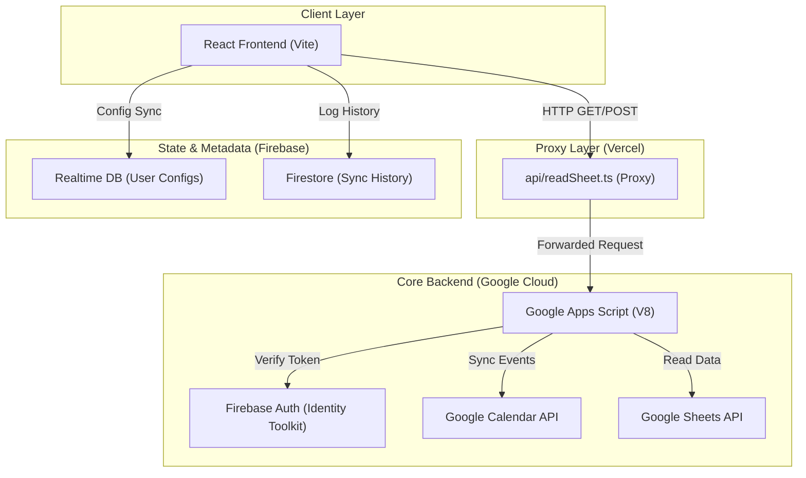

# Backend Architecture Review: Schedule Teaching

**Role: Backend Architect**  
**Date: 2026-02-06**

## Architecture Overview

The system follows a **Serverless Sidecar Proxy** architecture. The React frontend interacts with a Vercel-hosted API Proxy, which handles the communication with the specialized Google Apps Script (GAS) backend.



## API Endpoint Definitions (Internal Proxy)

### `GET /api/readSheet`
Fetches and wipes raw data from a Google Sheet.

*   **Request Params**:
    *   `action`: `readSheet`
    *   `url`: Full Google Sheets URL
    *   `startRow`: Row index to start reading (e.g., `3`)
*   **Success Response (200)**:
    ```json
    {
        "status": "success",
        "data": [["Row1Col1", "Row1Col2"], ["Row2Col1", "Row2Col2"]],
        "message": "Loaded 2 rows"
    }
    ```

### `POST /api/readSheet`
Syncs normalized events to Google Calendar.

*   **Request Body**:
    ```json
    {
        "idToken": "FIREBASE_ID_TOKEN",
        "calendarName": "Schedule Teaching",
        "events": [
            {
                "title": "[PRJ301] Nguyen Van A",
                "start": "2026-02-10T08:00:00+07:00",
                "end": "2026-02-10T10:00:00+07:00",
                "location": "Room 101"
            }
        ]
    }
    ```
*   **Success Response (200)**:
    ```json
    {
        "status": "success",
        "data": {
            "total": 1,
            "success": 1,
            "failed": 0
        }
    }
    ```

## Database Schema (Metadata)

### Firebase Realtime Database
Used for low-latency configuration persistence.
*   `/mappings/{mappingId}`:
    ```json
    {
        "columnMap": { "task": 1, "date": 3, "room": 5 },
        "headerRowIndex": 2,
        "lastUpdated": 1738812345678
    }
    ```

### Firestore
Used for structured, permanent sync history logs.
*   `Collection: sync_history`
    *   `userId`: string (index)
    *   `sheetId`: string
    *   `tabName`: string
    *   `timestamp`: serverTimestamp
    *   `counts`: { created: number, failed: number }

## Bottlenecks & Scaling Considerations

1.  **Serverless Timeouts**: Vercel (10s) and GAS (6 mins). If syncing many events (>50 per batch), the Vercel Proxy might time out before GAS confirms success.
    *   *Solution*: Implement asynchronous polling or chunked sync in the frontend.
2.  **Google Quotas**: The Calendar API has strict daily limits.
    *   *Solution*: Implement a "Dry Run" mode or use the Proxy layer to cache and batch requests.
3.  **Proxy Validation**: Currently, the Vercel Proxy forwards everything.
    *   *Recommendation*: Implement `idToken` verification at the **Vercel** level as well (using `firebase-admin`) to prevent unauthorized calls from ever reaching the GAS layer.

## Technology Recommendations

1.  **Caching**: Use a Redis layer (Upstash) on Vercel to cache parsed Sheet data for 5-10 minutes.
2.  **Logging**: Integrate Axiom or Datadog at the Vercel layer to trace Proxy -> GAS latency.
3.  **Security**: Move `ALLOWED_EMAILS` from GAS hardcode to a Firestore "Admin" collection for dynamic management.
