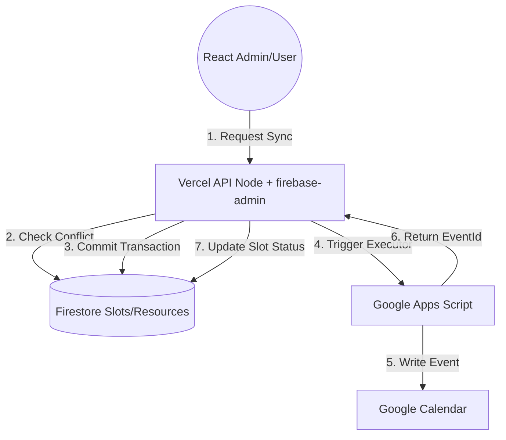

# IMPLEMENTATION.md – Kiến trúc & Hướng dẫn triển khai chi tiết

> **Mục tiêu**: Tích hợp hệ thống Agent (Claude-style) + Backend hiện tại (Apps Script + Firebase + React)
> để tạo một hệ thống **Schedule Teaching** an toàn, không trùng lịch, dễ mở rộng, không phá vỡ code đang chạy.

---

## I. Tổng quan kiến trúc cuối cùng (Final Architecture)

### 1. Nguyên tắc cốt lõi

* **Apps Script = Executor (Worker)**: Chỉ thực hiện các lệnh tạo/xóa trên Google Calendar.
* **Vercel / Backend Node = Brain (Logic + Security)**: Xử lý xác thực, kiểm tra xung đột và quản lý trạng thái.
* **Firestore = Single Source of Truth**: Lưu trữ tất cả các slot, cấu hình và lịch sử đồng bộ.
* **Google Calendar = Output / View Layer**: Hiển thị kết quả cuối cùng cho người dùng.

### 2. Sơ đồ luồng dữ liệu



---

## II. Mapping Agent → Project của bạn

| Agent                          | Trách nhiệm trong hệ thống                          |
| ------------------------------ | --------------------------------------------------- |
| **backend-architect**          | Thiết kế cấu trúc Firestore, API Contracts, Phân quyền |
| **debugger**                   | Theo dõi Logs, xử lý Retry khi GAS lỗi, Rollback     |
| **security-auditor**           | Verify ID Token, quản lý Secret Keys, Security Rules |
| **frontend-developer**         | UI chọn Resource, Preview Xung đột, Responsive       |
| **react-performance**          | Tối ưu render danh sách hàng nghìn Slot             |

---

## III. Phân tách trách nhiệm chi tiết

### 1. Những gì Apps Script KHÔNG ĐƯỢC LÀM
* ❌ Verify Firebase Token (Logic này tốn tài nguyên và khó maintain trên GAS).
* ❌ Check conflict (Truy vấn chéo các sự kiện trên GAS rất chậm).
* ❌ Quyết định business logic.

### 2. Những gì Apps Script CHỈ ĐƯỢC LÀM
* Nhận request đã được xác thực từ Backend Vercel.
* Thực thi: `createEvent`, `updateEvent`, `deleteEvent`.
* Trả về Metadata của Calendar (ví dụ: `eventId`).

---

## IV. Backend Logic (Vercel / Node.js)

### 1. Authentication & Authorization (Sử dụng Admin SDK)
```ts
import admin from 'firebase-admin'
// Chỉ Proxy (Brain) mới có quyền Admin
const decoded = await admin.auth().verifyIdToken(idToken)
if (!ADMIN_EMAILS.includes(decoded.email)) throw new Error('Forbidden');
```

### 2. Mô hình Slot (Conflict-Aware Model)
```ts
interface Slot {
  id: string; // signature hash
  start: Timestamp;
  end: Timestamp;
  resources: string[]; // ['teacher_A', 'room_101']
  calendarEventId?: string;
  status: 'draft' | 'confirmed' | 'error';
}
```

### 3. Thuật toán chống xung đột (Atomic Transaction)
Sử dụng Firestore Transaction để đảm bảo không có 2 người cùng đặt 1 phòng/giảng viên tại 1 thời điểm:
```ts
await runTransaction(db, async (transaction) => {
  // Query overlap: (start < newEnd) && (end > newStart)
  // Check if any resource in newResources is already busy
});
```

---

## V. Apps Script – Cấu trúc mới

### 1. Refactor `doPost`
Loại bỏ logic Auth phức tạp, chỉ giữ lại bảo mật bằng `SHARED_SECRET`.
```js
function doPost(e) {
  const payload = JSON.parse(e.postData.contents);
  if (payload.secret !== SCRIPT_SECRET) return jsonError_('Forbidden');

  // Gọi service thực thi
  const result = CalendarService.createEvents(payload.calendarName, payload.events);
  return jsonSuccess_(result);
}
```

---

## VI. Deployment Checklist

* [ ] **Environment Variables**: Thiết lập `GAS_SECRET` trên cả Vercel và Apps Script.
* [ ] **Firebase Admin**: Cấu hình Service Account cho Vercel.
* [ ] **Firestore Indexes**: Tạo Index cho các câu lệnh truy vấn thời gian giao nhau.
* [ ] **Apps Script Scope**: Chỉ cấp quyền `https://www.googleapis.com/auth/calendar`.

---

## VII. Kết luận
Kế hoạch này giúp biến ứng dụng từ một công cụ "vẹt" (chỉ biết copy-paste) thành một hệ thống **quản lý tài nguyên thực thụ**. 

---
*Bản kế hoạch này được tổng hợp và chuẩn hóa bởi đội ngũ Agent tư vấn.*
