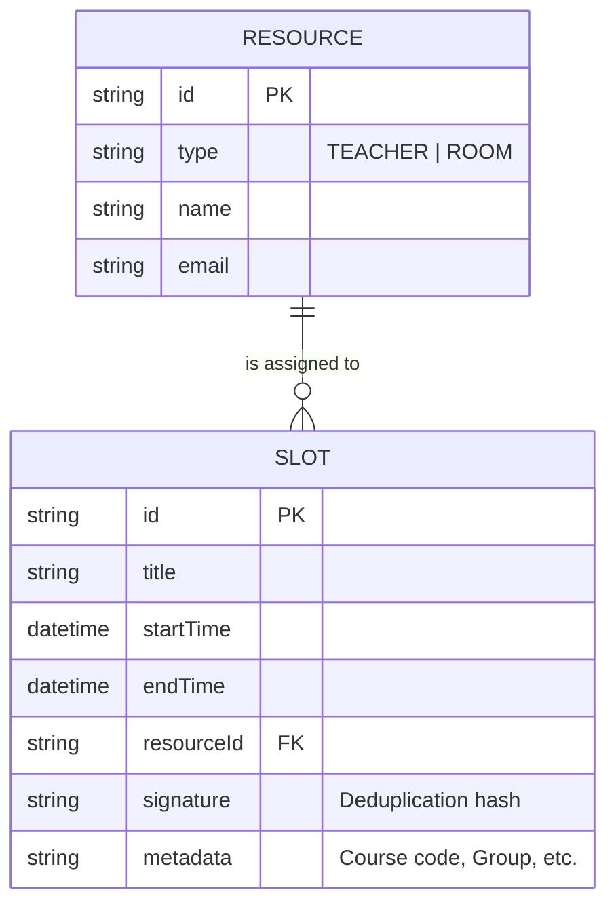

# Kiến trúc Hệ thống Lịch: Mô hình Dữ liệu và Chống Xung đột

**Vai trò: Backend Architect**
**Mục tiêu: Đề xuất mô hình dữ liệu có khả năng mở rộng (Scalable) và cơ chế ngăn chặn xung đột tài nguyên.**

## 1. Phân tích hiện trạng
Hiện tại, hệ thống chủ yếu thực hiện "Push" dữ liệu từ Excel lên Google Calendar.
- **Ưu điểm**: Nhanh, tận dụng tốt Google Calendar UI.
- **Hạn chế**: 
    - Google Calendar không tự động ngăn chặn overlapping events (cho phép 2 sự kiện trùng giờ).
    - Không có cơ chế quản lý tài nguyên (Phòng, Giảng viên) tập trung để phát hiện xung đột *trước* khi đồng bộ.

## 2. Mô hình Dữ liệu đề xuất (Resource-Oriented Model)

Để quản lý xung đột, chúng ta cần tách biệt giữa **Sự kiện (Slot)** và **Tài nguyên (Resource)**.



### Chi tiết Collection trong Firestore:
- **`resources`**: Danh mục Giảng viên và Phòng học.
- **`slots`**: Các khối thời gian đã được xác nhận.

## 3. Cơ chế Kiểm tra Xung đột (Conflict Detection)

Trước khi thực hiện `handleSync`, hệ thống sẽ thực hiện quy trình sau:

### Bước 1: Chuẩn hóa dữ liệu (Normalization)
Mỗi hàng trong Excel sẽ được tách thành các `PotentialSlots`. Một buổi học có "Giảng viên A" tại "Phòng 101" sẽ tạo ra 2 yêu cầu check:
1. `resourceId: Teacher_A`, `time: [Start, End]`
2. `resourceId: Room_101`, `time: [Start, End]`

### Bước 2: Truy vấn Xung đột (Collision Query)
Sử dụng thuật toán Overlap (Giao nhau): `(A.Start < B.End) AND (A.End > B.Start)`.

**Firestore Query**:
```typescript
const q = query(
  collection(db, "slots"),
  where("resourceId", "==", targetResourceId),
  where("startTime", "<", newEventEndTime),
  where("endTime", ">", newEventStartTime)
);
```

## 4. Giải pháp mở rộng (Scalability)

1.  **Composite Indexes**: Cần tạo index cho `(resourceId, startTime, endTime)` để tối ưu tốc độ truy vấn khi danh sách `slots` lên tới hàng chục nghìn.
2.  **Transaction/Batch**: Sử dụng `writeBatch` trong Firestore để đảm bảo tính toàn vẹn: "Nếu một slot trong bộ bị xung đột, toàn bộ không được lưu".
3.  **Real-time UI**: Hiển thị cảnh báo xung đột (màu đỏ) ngay tại bảng `ScheduleTable` trước khi người dùng nhấn nút "Đồng bộ".

## 5. Lộ trình thực hiện (Roadmap)
- [ ] **Phase 1**: Tạo collection `slots` để lưu lịch sử các sự kiện đã đồng bộ thành công (thay vì chỉ lưu `syncHistory` tổng quát).
- [ ] **Phase 2**: Viết service `ConflictChecker` để gọi trước `syncEventsToCalendar`.
- [ ] **Phase 3**: Cập nhật UI để giảng viên thấy được các slot đang bị trùng lịch/trùng phòng ngay trên app.

---
*Bản review này tập trung vào tính thực tiễn và khả năng mở rộng của hệ thống Firebase hiện có của bạn.*
